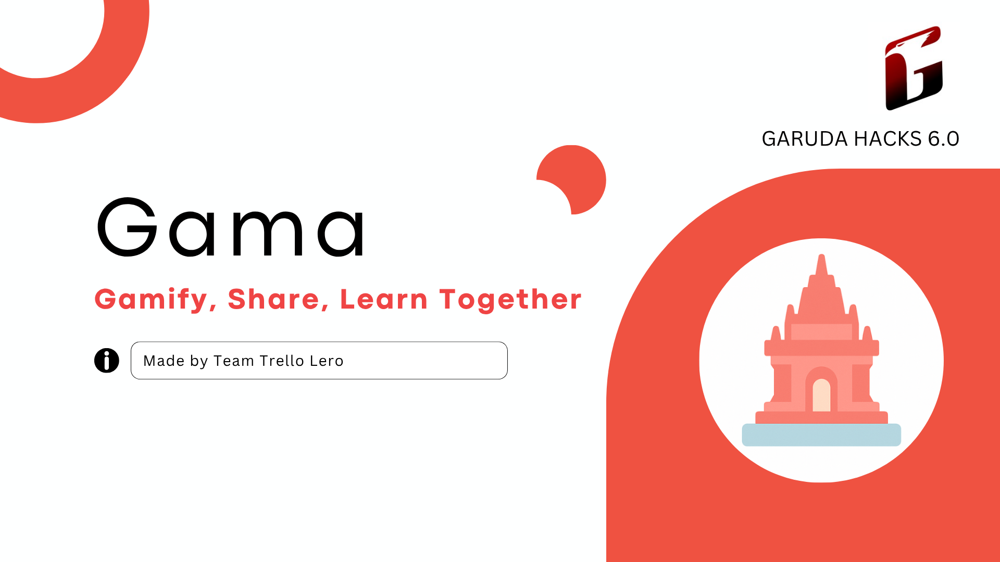
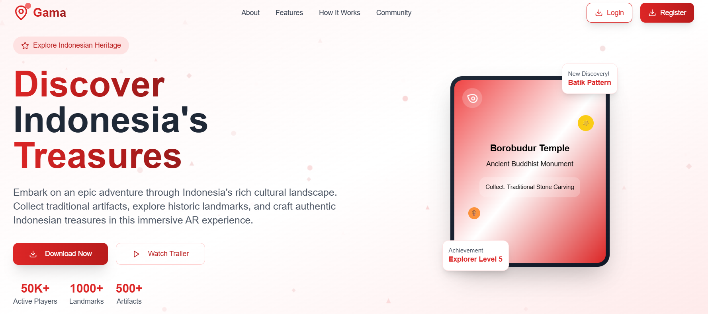
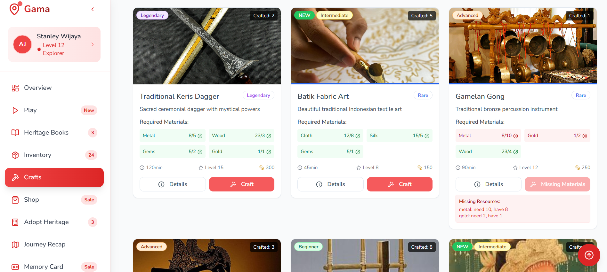
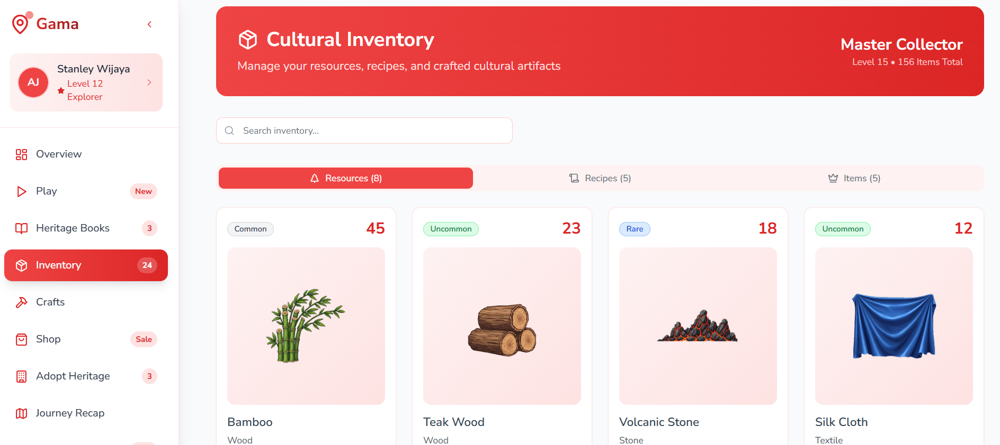
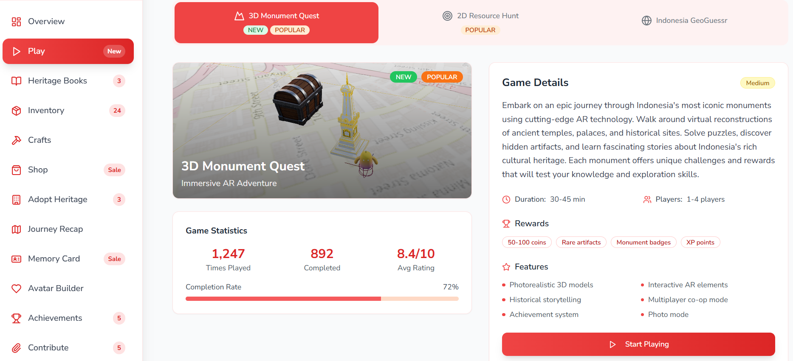
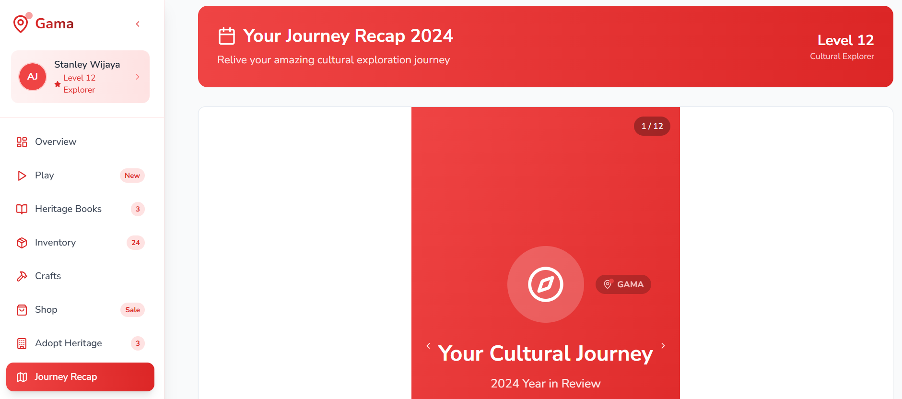
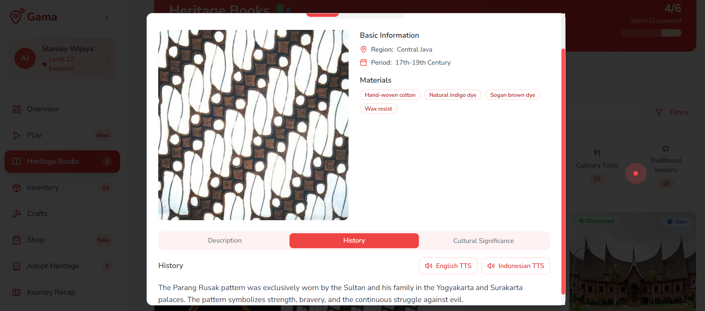
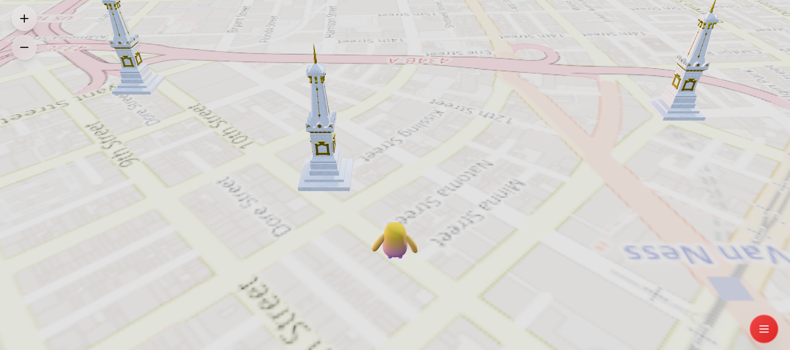
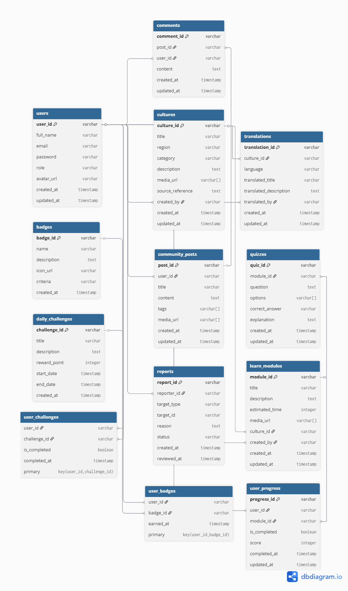

<div align="center">
    <div>
        
    </div>
    <div>
            <h3><b>Gama</b></h3>
            <p><i>Gamify, Share, and Learn Together!</i></p>
    </div>      
</div>
<br>
<h1 align="center">Gama - Garuda Hacks 6.0 Hackathon</h1>
<div align="center">



</div>
<br>

<b>Gama</b> is a cultural learning and preservation platform that empowers communities to contribute, explore, translate, and gamify Indonesian heritage. In a time where languages, traditions, and knowledge are disappearing, Gama helps people reconnect with culture through technology, interaction, and storytelling. It brings fun, inclusivity, and accessibility into cultural learning—ensuring that the spirit of <i>Bhinneka Tunggal Ika</i> continues to thrive.

<a href="https://devpost.com/software/gama-xg1mqc?_gl=1*1kxfpz8*_gcl_au*MjUwNjA4NzA5LjE3NDk5NTEzMDc.*_ga*OTk5MTg3MTE4LjE3NDk5NTEzMDg.*_ga_0YHJK3Y10M*czE3NTM1OTMyNTUkbzQwJGcxJHQxNzUzNTkzMjY2JGo0OSRsMCRoMA..">GarudaHacks 6.0 Hackathon DevPost Link</a>

---

## 📃 Table of Contents
- [⚙️ Technology Stack](#-technology-stack)
- [🧩 Core Features](#-core-features)
- [🚀 Live Demo](#-live-demo)
- [🧰 Getting Started Locally](#-getting-started-locally)
- [🔐 .env Configuration](#-env-configuration)
- [📸 Website Preview](#-website-preview)
- [🧭 Diagram](#-diagram)
- [👥 Owner](#-owner)
- [📬 Contact](#-contact)

---

## ⚙️ Technology Stack

<div align="center">

<kbd></kbd>
<kbd></kbd>
<kbd></kbd>
<kbd></kbd>
<kbd></kbd>
<kbd></kbd>
<kbd></kbd>
<kbd></kbd>
<kbd></kbd>
<kbd></kbd>
<kbd></kbd>

</div>

<div align="center">
<h4>React | TypeScript | Vite | Tailwind CSS | Shadcn UI | MongoDB | Express JS | Node JS | Python | Flask | Hugging Face</h4>
</div>

---

## 🧩 Core Features

### 📚 Cultural Content Library
- Explore rich content on traditional dances, folktales, artifacts, and culinary heritage
- Multimedia-based content (image, audio, video, narration, ancient script)

### 🧠 Community-Driven Translation
- Users can collaboratively translate cultural assets into local and global languages
- Support for rare scripts: Javanese, Balinese, Dutch Colonial, etc.

### 🕹️ Gamified Learning System
- Learn through missions, quizzes, and streaks
- Earn badges and rank up on cultural knowledge leaderboards

### 🎤 Content Submission Portal
- Anyone can contribute: audio folklore, dialect samples, old manuscripts, or historical photos
- Curated by moderators and experts to ensure quality

### 🌐 Community & Challenges
- Weekly cultural challenges (e.g., “Upload a forgotten legend from your village”)
- Community post board for storytelling, reflection, and cultural sharing

---

## 🚀 Live Demo

👉 [https://gama-gh6.vercel.app/](https://gama-gh6.vercel.app/)

---

## 🧰 Getting Started Locally

### Prerequisites
- **Node.js** (v16+)
- **MongoDB**
- **Python**
- **Git**

### Clone the Project
```bash
git clone https://github.com/lLAlAlex/Gama.git
cd Gama
cd Frontend
npm install
npm run dev
```

---

## 🔐 .env Configuration

.env for the Backend
```
MONGO_URI=
JWT_SECRET=
PORT=
```

---

## 📸 &nbsp;Website Preview
<table style="width:100%; text-align:center">
    <col width="100%">
    <tr>
        <td width="1%" align="center"></td>
    </tr>
    <tr>
        <td width="1%" align="center">Home Page</td>
    </tr>
    <tr>
        <td width="1%" align="center"></td>
    </tr>
    <tr>
        <td width="1%" align="center">Crafts Page</td>
    </tr>
    <tr>
        <td width="1%" align="center"></td>
    </tr>
    <tr>
        <td width="1%" align="center">Inventory Page</td>
    </tr>
    <tr>
        <td width="1%" align="center"></td>
    </tr>
    <tr>
        <td width="1%" align="center">Play Page</td>
    </tr>
    <tr>
        <td width="1%" align="center"></td>
    </tr>
    <tr>
        <td width="1%" align="center">Journey Recap Page</td>
    </tr>
    <tr>
        <td width="1%" align="center"></td>
    </tr>
    <tr>
        <td width="1%" align="center">Heritage Books Page</td>
    </tr>
    <tr>
        <td width="1%" align="center"></td>
    </tr>
    <tr>
        <td width="1%" align="center">3D Monument Quest Game</td>
    </tr>
</table>

---

## 🧭 Diagram

*Overall Database System Flow:*
<p align="center">
  
</p>

This diagram shows how the models connected using ERD Diagram

---

## 👥 Owner

This Repository is created by Trello Lero Team
<ul>
<li>Stanley Nathanael Wijaya - Team Lead and Frontend Dev</li>
<li>Nathaniel Alexander - Fullstack Developer</li>
<li>Nicholas Chandra - Software Developer</li>
</ul>
As Hackathon Project for Garuda Hacks 6.0 Hackathon

---

## 📬 Contact
Have questions or want to collaborate?

- 📧 Email: stanley.n.wijaya7@gmail.com
- 💬 Discord: `stynw7`

<code>Made with ❤️ by Trello Lero Team</code>